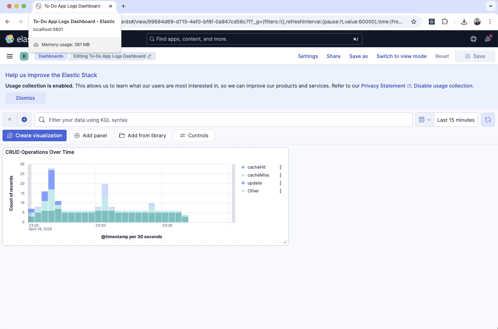

# To-Do List Application
*A fully containerized full‑stack To‑Do List application*

## Demo Video

[](https://www.loom.com/share/1516c16afb994b1cb177abcb18c9d40a)

## Tech Stack

- **DevOps:** Docker & Docker Compose, ELK Stack (Elasticsearch, Filebeat, Kibana)
- **Backend:** NestJS, MongoDB, RabbitMQ, Redis, Apollo GraphQL
- **Frontend:** React, Next.js, SCSS, Apollo Client

_Last Updated: April 20, 2025_ 

## Table of Contents
1. [Project Overview](#project-overview)
2. [Tech Architecture](#tech-architecture)
3. [Getting Started](#getting-started)
4. [Dockerization Rationale](#dockerization-rationale)
5. [Logging & Visualization](#logging--visualization)
6. [Kibana Dashboard Import](#kibana-dashboard-import)
7. [Screenshots](#screenshots)
8. [License](#license)

## Project Overview
This application provides GraphQL‑powered CRUD operations for tasks, backed by MongoDB, cached in Redis, and events published to RabbitMQ. All operations emit structured JSON logs that are collected by Filebeat and visualized in Kibana.

## Tech Architecture

```plaintext
[Frontend: Next.js] <--GraphQL--> [NestJS Backend]
                             |
                             +--> MongoDB    (store tasks)
                             +--> Redis      (cache list queries)
                             +--> RabbitMQ   (publish task events)
                             +--> Filebeat -> Elasticsearch -> Kibana (logs)
```

## Getting Started

### Prerequisites
- Docker & Docker Compose v1.29+
- Node.js v14+ (for local development outside containers)

### Local Development (Docker Compose)
1. Clone the repo:
   ```bash
   git clone https://github.com/innovategy/todo-list.git
   cd todo-list
   ```
2. Build and start all services:
   ```bash
   docker-compose up --build -d
   ```
3. Verify services:
   - Frontend: http://localhost:3000
   - GraphQL API: http://localhost:4000/graphql
   - Kibana:    http://localhost:5601

4. Stop services:
   ```bash
   docker-compose down
   ```

## Dockerization Rationale
- **NestJS Backend:** Isolated environment, consistent Node version, simplified dependency management.
- **React Frontend (Next.js):** Encapsulates build/runtime, ensures parity across machines.
- **MongoDB:** Containerized for data isolation and easy teardown.
- **Redis:** Ephemeral cache service, container simplifies local setup.
- **RabbitMQ:** Messaging broker in a container for consistent configuration.
- **Elasticsearch:** Stateful search engine, containerized for easy orchestration.
- **Filebeat:** Collects logs from NestJS, container ensures correct version/config.
- **Kibana:** Visualization UI, container ensures compatibility with Elasticsearch.

## Logging & Visualization
- The NestJS app logs every operation in JSON:
  ```json
  {"timestamp":"...","level":"info","operation":"createTask","taskId":"...","payload":{...}}
  ```
- Filebeat harvests `/app/logs/*.json` and forwards to Elasticsearch.
- Kibana provides a dashboard for tracking CRUD events and errors.

## Kibana Dashboard Import
1. Open Kibana at `http://localhost:5601`.
2. Go to **Management > Saved Objects**.
3. Click **Import**, select `helm/kibana/kibana-dashboard.json`.
4. Apply default index pattern `filebeat-*`.

## Screenshots

**CRUD Operations Over Time**



## License
+ 2025 by Innovategy Oy is licensed under CC BY 4.0
